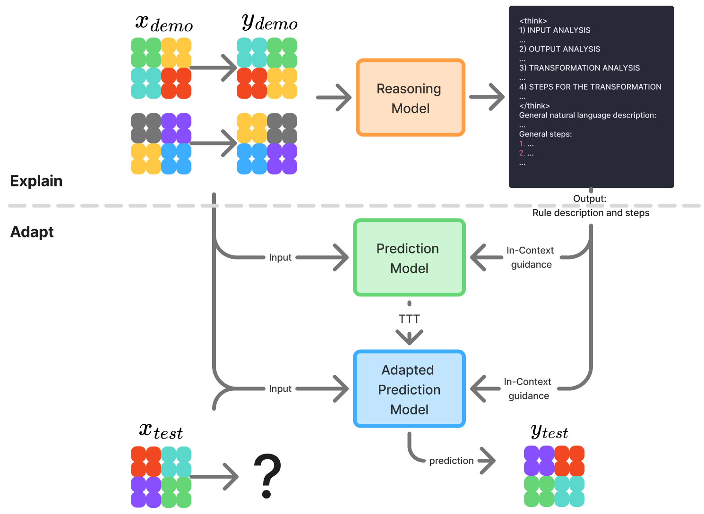

# Methodology

Explain-then-Adapt combines two forms of test-time computation for ARC-AGI:
reasoning over a task in natural language and parameter adaptation on that
task's demonstrations. A Reasoning Model first proposes a transformation rule;
a separate Prediction Model then uses the compact rule as guidance during
task-specific Test-Time Training (TTT) and final candidate generation.



## System Overview

The method has two stages:

1. **Explain.** The Reasoning Model receives only the demonstration pairs. In
   its chain of thought, it compares inputs and outputs, considers candidate
   objects, values, geometry, and relations, and searches for one rule that is
   consistent across the examples. It returns both the detailed analysis and a
   compact transformation hypothesis.
2. **Adapt.** The compact hypothesis is placed in a system message before the
   task's demonstration pairs. The Prediction Model is adapted on augmented
   versions of those pairs and then generates candidates for the test input.

The chain of thought itself is not passed to the Prediction Model. Only the
general natural-language description and the ordered application steps after
the final `</think>` tag become guidance.

## Reasoning Data

ARC tasks contain grids but no textual explanation of the hidden rule. The
Reasoning Model therefore requires a synthetic training corpus whose target is
a consistent, parseable reasoning trace.

### Base Tasks

The split construction used in the thesis produced 624 base tasks after
excluding overlaps with the ARC-AGI-1 evaluation tasks. The versioned resources
contain one selected base trace per task, five manually prepared few-shot
traces, and all recoverable generation metadata.

Initial trace generation used Gemini 3 Flash with two worked examples selected
from the five-example pool. Two supervision routes were used:

- 481 tasks included complete, manually curated hints about the inputs,
  outputs, transformation, and application steps;
- 143 tasks were generated without complete hints and inspected manually.

The second route became practical once the stronger Gemini model made direct
generation less expensive than writing the remaining task-specific hints.
Hints constrain the search but are not copied into the target explanation.

### Trace Format

Every accepted trace follows this structure:

```text
<think>
1) INPUT ANALYSIS
2) OUTPUT ANALYSIS
3) TRANSFORMATION ANALYSIS
4) STEPS FOR THE TRANSFORMATION
</think>

General natural language description:
...

General steps:
...
```

The four analysis sections capture the search over possible rules. The two
sections after `</think>` are the compact interface between the Reasoning Model
and the Prediction Model.

### Validation

Static validation first checks all required tags and headings in order. The
automatic quality-control route then asks a separate LLM judge for five
independent verdicts and accepts a candidate only when all five pass. The judge
used in the final setup was `gpt-oss-120b` served through vLLM.

The later hint-free route used manual inspection instead of the five-vote judge
when repeating that compute was no longer cost-effective. These routes remain
separate in the rebuilt records: a manual decision is never presented as a
`judge_5_of_5` result. Historical per-task judge provenance could not be
recovered for every hint-backed trace, so the manifest records unknown
provenance rather than inferring it.

### Trace-Aware Augmentation

Each accepted task is augmented with three operations:

- one of eight geometric transforms;
- a permutation of grid values 0 through 9;
- a permutation of the demonstration order.

Grid augmentation alone is insufficient because a trace may refer to colors,
directions, positions, or demonstration indices. An LLM therefore rewrites the
trace after each augmentation so that its language remains consistent with the
transformed task. Malformed rewrites are discarded, and generation continues
across additional runs until each task has 100 accepted variants.

The rewrite stage uses strict static validation but no five-vote judge for every
variant. The original large rewrite corpus is no longer available; new training
corpora are generated from the 624 versioned base traces and receive their own
provenance. The full workflow is documented in the
[data-generation README](../src/explain_then_adapt/data_generation/README.md).

## Offline Training

Both learned model roles build on `Qwen/Qwen3-4B-Thinking-2507`. The thesis used
QLoRA with a 4-bit base model, rank 128, alpha 32, and adapters on all attention
and feed-forward projections. The synthetic Reasoning and Prediction Model runs
used a global batch size of 16, an 8,192-token limit, and one distinct variant
of each of the 624 tasks per epoch for 100 epochs. The ReARC profiles use their
own corpus size and schedule. A stratified 39-task split was evaluated in both
original and augmented form for checkpoint selection.

### Reasoning Model

The Reasoning Model receives one user turn containing the demonstrations. Its
assistant target contains the complete trace, from `<think>` through the final
general steps. Cross-entropy is computed only over assistant tokens; the input
and padding tokens are masked.

### Prediction Model

For guided training, the compact rule and steps become a system message. Every
available input-output pair is serialized as a user grid followed by an
assistant grid, and the pairs are shuffled together. Loss is computed only on
the exact output-grid spans. The first output is masked in the main setup so the
model must use one observed pair as context before receiving supervised output
loss.

Five Prediction Model variants separate the effects of guidance, loss masking,
and training data:

| Variant | Training source | Rule guidance | First output in loss |
| --- | --- | --- | --- |
| `Unguided` | synthetic ARC variants | no | no |
| `Guided` | synthetic ARC variants | yes | no |
| `Guided-see-first` | synthetic ARC variants | yes | yes |
| `Unguided-ReARC` | ReARC | no | no |
| `Guided-ReARC` | ReARC, then synthetic guided fine-tuning | yes | no |

Exact profiles, cache contracts, checkpoint selection, and training commands
are kept in the [training README](../src/explain_then_adapt/training/README.md).

## Test-Time Training

At inference time, every evaluation task receives a fresh Prediction Model LoRA
adapter. TTT uses only the labelled demonstrations; test inputs and test outputs
never enter the adaptation objective.

The final setup creates 64 training conversations: eight value/order variants
for each of the eight geometric transforms. It performs one batch-size-one
optimizer update per conversation. The temporary adapter uses rank 32 and alpha
16 and is removed before moving to the next task.

In a fully guided run, the Reasoning Model produces an augmentation-specific
rule for every TTT conversation. The guidance budget `k` controls how many of
the 64 updates receive such a rule:

| `k` | Guided variants per transform | Guided TTT updates |
| ---: | ---: | ---: |
| 0 | 0 | 0 |
| 8 | 1 | 8 |
| 16 | 2 | 16 |
| 32 | 4 | 32 |
| 64 | 8 | 64 |

The subset is nested and balanced over geometric transforms. Non-selected
updates retain the guided prompt shape with empty guidance. The unguided
baseline is a separate profile with no system message at all.

## Candidate Generation

The Reasoning Model emits exactly one trace for every view that requires
guidance. After optional TTT, the Prediction Model is evaluated with one of the
following protocols:

| Protocol | Task views | Samples per view | Candidates per test input |
| --- | ---: | ---: | ---: |
| `standard32` | original task | 32 | 32 |
| `augmented64` | all 64 augmentations | 1 | 64 |
| `budgeted64`, `k = 0` | original task | 64 | 64 |
| `budgeted64`, `k > 0` | selected `k` augmentations | `64 / k` | 64 |

Augmented candidates are generated in transformed grid space. Evaluation
reverses the geometry and value permutation before comparing them with the
target. The thesis did not use a learned candidate selector or verifier; its
solve rate is therefore an oracle best-of-N coverage metric over the generated
pool.

The implementation and artifact contracts are described in the
[inference README](../src/explain_then_adapt/inference/README.md).

## Evaluation and Compute

The two principal thesis metrics are:

- **Thesis Solve:** fraction of task IDs for which at least one generated grid
  matches at least one test output;
- **Sample Accuracy:** fraction of all generated grids that match their target.

The rebuilt evaluator additionally reports strict all-test-input solve, because
the historical task-level aggregation is permissive for tasks with multiple
test inputs. Parsing failures count as incorrect predictions. No candidate is
silently dropped or reranked.

The budget study uses a token-based seconds-equivalent cost:

```text
C_total = (T_prefill + 3 * T_train) / r_prefill + T_gen / r_decode
```

The thesis profile uses measured A100 rates of 5,000 prefill tokens/s and 75
decode tokens/s. This is a hardware-dependent comparison between experiment
configurations, not a FLOP count or a universal wall-clock estimate.

Metric definitions, inverse transformations, and compute accounting are
documented in the [evaluation README](../src/explain_then_adapt/evaluation/README.md).
The reported findings are summarized in [Results](results.md).
